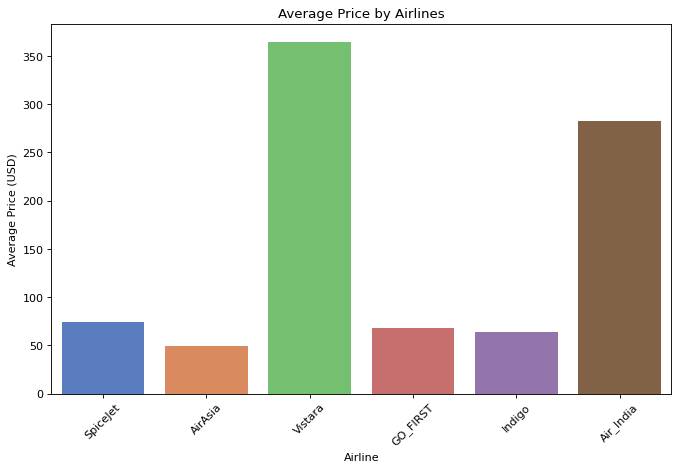
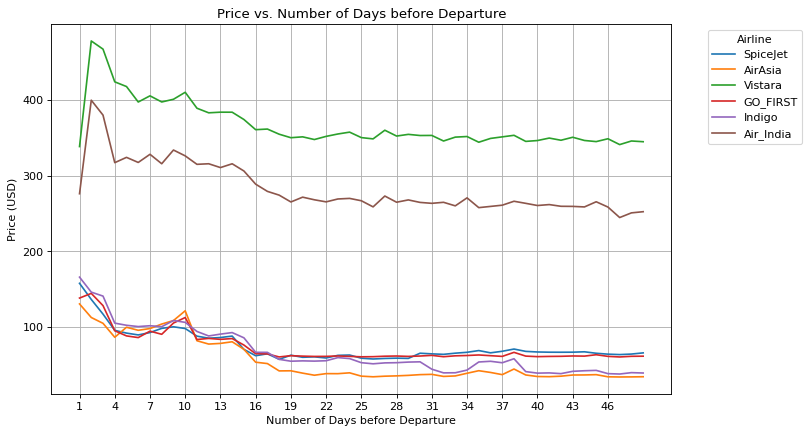
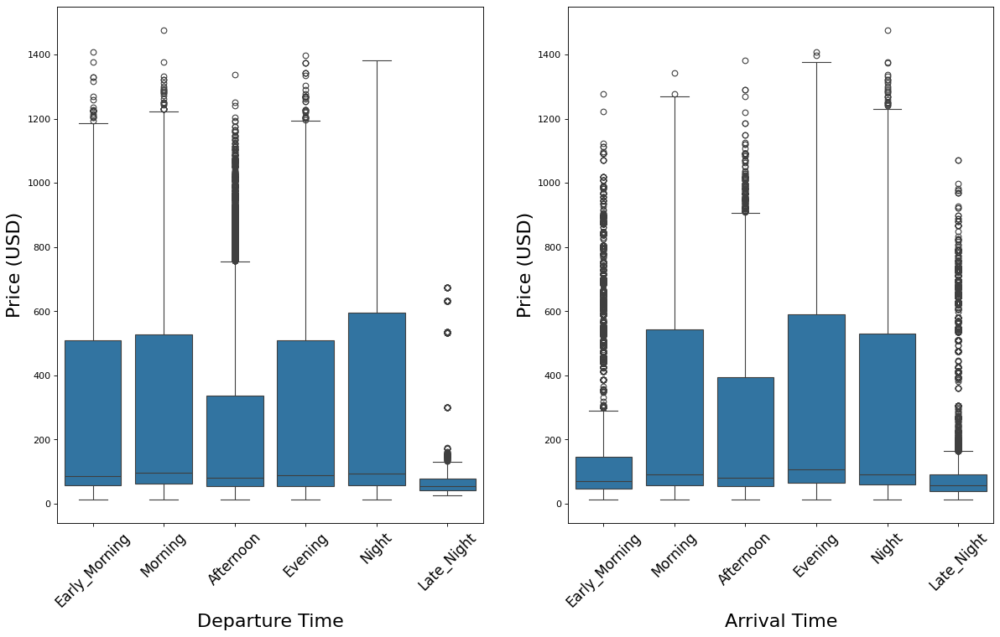
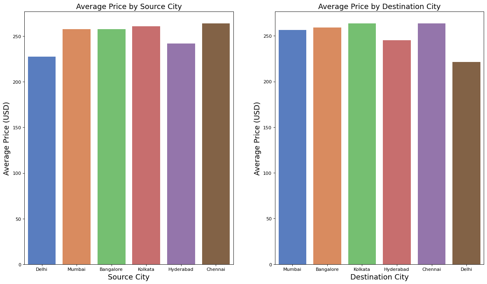
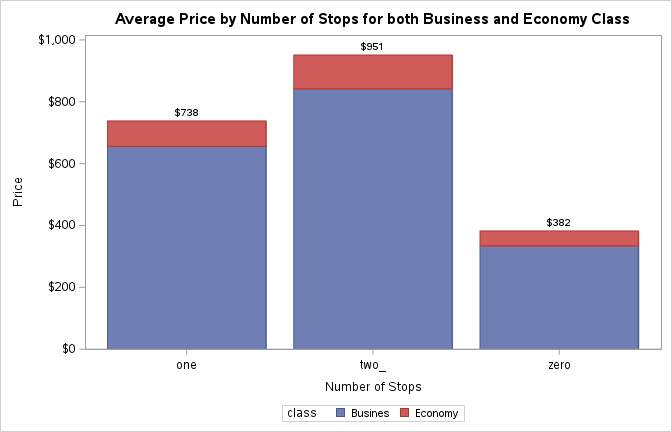

# ✈️ Flight Price Analytics: what drives airline ticket prices?

Analysis of **300,153 flight bookings** from EaseMyTrip, covering India's six largest metro cities, to find what drives ticket prices. The project ends with a linear regression model that predicts price. The full analysis was built twice, in **Python** and in **SAS**, and closes with a critical comparison of the two tools.

**Tools:** Python (pandas, seaborn, scikit-learn) · SAS (PROC SGPLOT, SGPANEL, SGPIE, REG) · Jupyter

---

## Key results

| | |
|---|---|
| **Model** | Linear regression on airline, class, stops and duration |
| **Test R²** | **0.90**: the model explains 90% of the variance in price |
| **Test MAE** | **$58.85** (train $59.02), so no sign of overfitting |
| **Data** | 300,153 rows · 11 features · no missing values |

## Business questions answered

**1. Does price vary with airline?** Yes, a lot. Vistara (about $365) and Air India (about $282) are the premium carriers. AirAsia is the cheapest at about $49.



**2. What happens if you book 1–2 days before departure?** Economy fares one day out average about **$175, roughly 3 times** the $57–64 paid three or more weeks ahead. Prices start climbing around 16 days out. Vistara and Air India are the exception: they drop prices on the final day.



**3. Does time of day matter?** Late-night flights are clearly the cheapest. The median late-night departure costs about $54, against $80–97 for other times.



**4. Economy vs Business?** Business tickets average about **$630, roughly 8 times** Economy's $79. Class is the single biggest driver of price.



**5. Number of stops.** Non-stop flights are the *cheapest* on average in both classes. They tend to serve shorter routes, so the number of stops partly stands in for distance.

<details>
<summary>Same analysis in SAS (PROC SGPLOT output)</summary>



</details>

---

## Python vs SAS

The analysis was built end to end in both tools and then scored on 11 criteria (efficiency, scalability, ease of use, visualisation, libraries, deployment and more).

| | SAS University Edition | Python |
|---|---|---|
| Strengths | Efficient on large datasets, mature statistical procedures, strong built-in graphics | Free, flexible, huge library ecosystem, easier to learn and deploy |
| Total score (out of 110) | 92 | **95** |

Python came out slightly ahead for this project, but the right choice depends on the team's skills and existing infrastructure. The full comparison is in [the report](report/flight_price_analytics_report.pdf).

---

## Team version (4-person group project)

A team version of the project, built mainly in SAS, added a classification model alongside the price regression:

- **Linear regression on class alone explained 88% of price variance** (R² = 0.88, p < 0.0001). Business class costs about **$552 more** than Economy once everything else in the model is held constant.
- **PROC LOGISTIC model predicting non-stop vs connecting flights** from price and class reached **86.7% concordance** (Somers' D = 0.734).

Full write-up: [group project report](report/group_project_report.pdf)

---

## Repository structure

```
├── python/flight_price_analysis.ipynb   # EDA, visualisation and regression model (executed, with outputs)
├── sas/flight_price_analysis.sas        # The same pipeline in SAS
├── images/                              # Charts used in this README
├── report/                              # Written reports: individual and team (PDF)
└── data/                                # Put Clean_Dataset.csv here (not included)
```

## How to run

1. Download `Clean_Dataset.csv` from [Kaggle: Flight Price Prediction](https://www.kaggle.com/datasets/shubhambathwal/flight-price-prediction) into `data/`.
2. Install the dependencies: `pip install -r requirements.txt`
3. Open `python/flight_price_analysis.ipynb` and run all cells.

To run the SAS version, upload the CSV to SAS Studio and set `%let path` at the top of `sas/flight_price_analysis.sas`.

## What I'd do next

- Replace label encoding of `airline` with one-hot encoding. Airline has no natural order, so a single integer code forces a linear model to treat it as one.
- Try gradient boosting or random forest. The largest errors are on Business-class fares, where price behaves non-linearly.
- Add route (source → destination) and `days_left` as features. Booking time is one of the strongest signals in the EDA but isn't in the current model.

---

*Built as part of my MSc Big Data Analytics (Business Analytics module), University of Derby, 2024.*
